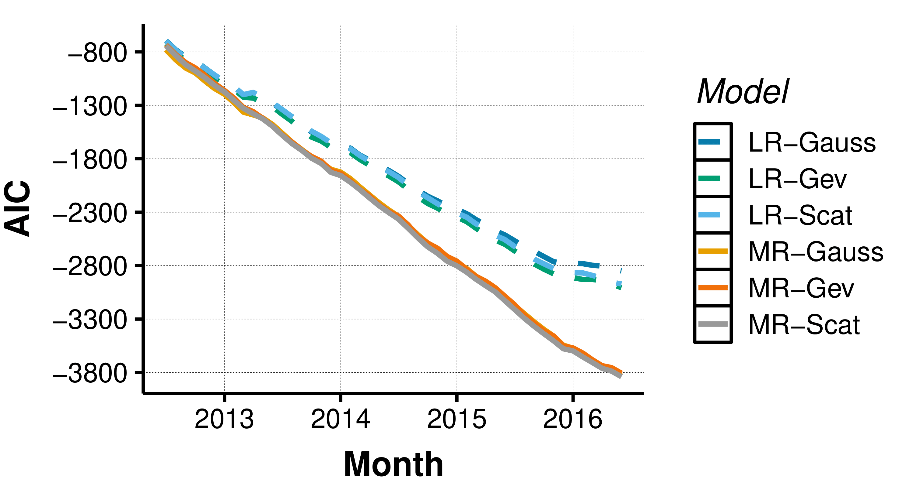
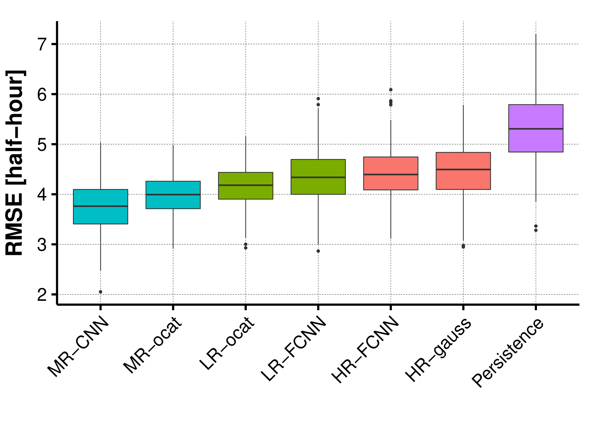

# Multi-Resolution Forecasting

We present a methodology to forecast (daily) peaks in terms of their magnitude and timing. 
While our work is embedded in the context daily peak electrical load forecasting, the method proposed can be extended to any peak modelling problem so long as there is data available at a higher resolution than the timescale of the peak. 
The modelling approach proposed leverages high-resolution and low-resolution information to forecast daily peak demand magnitude and timing. It is therefore called: multi-resolution forecasting. 

A thorough walkthrough of the proposed approach is detailed in the following publication:

* **Yvenn Amara-Ouali, Matteo Fasiolo, Yannig Goude, Hui Yan** - *Daily peak electrical load forecasting with a multi-resolution approach* (2022) - [International Journal of Forecasting](https://doi.org/10.1016/j.ijforecast.2022.06.001.
(https://www.sciencedirect.com/science/article/pii/S0169207022000929)

Keywords: Generalised additive models; Neural networks; Peak load forecasting; Smart grids; Automated feature engineering; Multi-resolution

## Getting Started

This repository contains all codes produced for the experiments detailed in our paper. 

"1. Sample Code" contains all the R and Python scripts used for preparing data, training models and producing forecasts
Within this folder:
* "1. Data" contains the prepared data and 
* "2. Pred Signals" is a placeholder for predections, model weights, and other files generated during the analysis
* "3. Plots" is a placeholder for visualisations produced along the code

Please note that to make the repository as efficient as possible we have removed the datasets that are created throughout the code.
To make sure the codes run properly please do not forget to uncomment commands in the codes such as the following:

```
save(file = "1. Sample Code/2. Pred Signals/1. GAMs/high_res_rolling_bam.RData", high_res_pred)
```

### Prerequisites

The multi-resolution approach is illustrated for two main classes of models:
* Generalised Additive Models (GAM)
* Neural Networks (NN)

GAM are 

#### R:

* R packages

Here are the various R packages that can be directly installed in Rstudio as follows:

```
install.packages("tidyverse")
install.packages("lubridate")
install.packages("mgcViz")
install.packages("corrplot")
install.packages("electBook")
install.packages("RhpcBLASctl"); blas_set_num_threads(1) # Optional
install.packages("stringr")
install.packages("magrittr")
install.packages("matrixStats")
install.packages("lubridate")
install.packages("dplyr")
install.packages("plyr")
install.packages("mvnfast")
install.packages("rstudioapi")
install.packages("gridExtra")
install.packages("forecast")
install.packages("ggthemes")
install.packages("forecast")
install.packages("multDM")
install.packages("formattable")
```

* Python libraries

Here are the various Python libraries to install with the following command lines (please not that some of them might already be installed by default):

```
pip install numpy
pip install keras
pip install tensorflow
pip install matplotlib
pip install seaborn
pip install pandas
pip install datetime
pip install os
pip install copy
pip install warnings
```

## Main advantages

-More accurate


-More parsimonious



## Author
* **Yvenn Amara-Ouali** - (https://www.yvenn-amara.com)

## License

This project is licensed under the GNU GPLv3 License - see the [LICENSE.md](LICENSE.md) file for details
